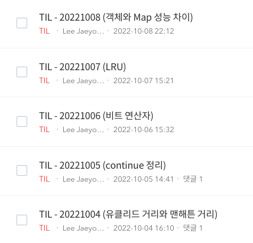

# 시작하기 전에 앞서...

> 안녕하세요!

&nbsp;안녕하세요! 기념비(?)적인 제 블로그의 첫 게시물이자 앞으로 계속해서 작성할 블로그 제작기의 첫 게시물이기도 합니다! 글솜씨, 개발 실력 모두 아직 부족하지만 앞으로 개발 블로그를 통해 두 마리 토끼 모두 잡아보려 노력하겠습니다. 많은 성원과 관심 부탁드립니다!

# 시작은 2022년으로부터...
2022년 10월 15일. 토요일이었습니다. 여러분들은 무엇을 하고 계셨나요? 기억력이 좋으신 분들이나 관계자라면 바로 기억하시겠지만, 이날은 대한민국 국민 90% 이상은 경험한 큰 사건이 터진 날입니다. 바로 [SK C&C 판교 데이터센터 화재로 인한 인터넷 서비스 장애 사건](https://namu.wiki/w/SK%20C%26C%20%ED%8C%90%EA%B5%90%20%EB%8D%B0%EC%9D%B4%ED%84%B0%EC%84%BC%ED%84%B0%20%ED%99%94%EC%9E%AC%EB%A1%9C%20%EC%9D%B8%ED%95%9C%20%EC%9D%B8%ED%84%B0%EB%84%B7%20%EC%84%9C%EB%B9%84%EC%8A%A4%20%EC%9E%A5%EC%95%A0%20%EC%82%AC%EA%B1%B4)으로 인한 카카오의 많은 서비스가 사용할 수 없었던 날이었는데요. 처음엔 카카오톡만 안 되나보다라고 단순하게 생각하고 있었지만, 이때 저는 매일 매일 하고 있던 게 있었습니다.

&nbsp;바로 ?월 ?일부터 사건이 터지기 전날인 10월 14일 매일 게시글을 작성하고 있었습니다. 당시 매일 공부한 내용을 TIL로 기록하는 활동을 진행하고 있었는데 괜찮겠지~라는 안일한 생각으로 공부했던 내용을 오후에 올리려 했지만 끝내 올리지 못했습니다. 그러면 10월 15일은 넘어가고 10월 16일부터 다시 하면 되는 거 아니냐고 물어보실 수 있지만 이때 여러 생각을 하게 됩니다.

&nbsp;매일 진행하던 루틴이 깨져 현타가 오기도 하고 슬프기도 했지만, 그 무엇보다 가장 중요한 건 장애가 발생했을 때 제가 손 쓸 수 있는 게 없다는 점이었습니다. 왜 게시물이 안 올라갈까에 대한 답을 얻을 수 있어도 그러면 어떻게 해결할 수 있을까는 카카오가 해결해 주기 전까지 기다릴 수밖에 없었던 점이 아! 그러면 내가 장애를 직접 해결할 수 있고 첫 프로젝트로 기술 블로그를 만들어야겠다! 라는 생각으로 결론이 내려져 기술 블로그를 만들기 시작한 계기였습니다.
