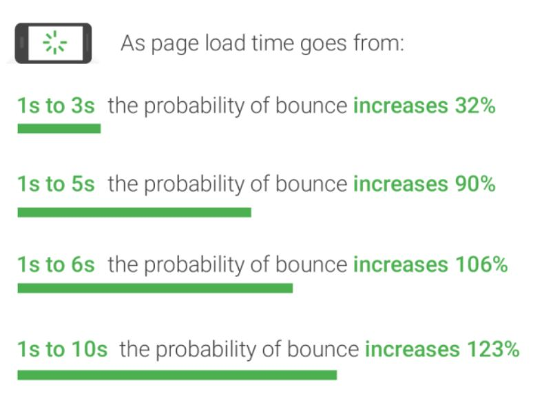

# tl;dr

장애 상황에서도 직접 관리할 수 있는 개인 블로그를 만들기 위해 기술 스택 선정 기준으로 SEO, 빠른 렌더링, 그리고 주니어 개발자도 감당 가능한 난이도를 설정했다. CSR 기반 React 단독 구성은 SEO 측면에서 제외했고, SSG 방식으로 SEO와 성능을 동시에 만족하는 Gatsby를 선택했다. React 기반이라 학습 부담이 적고, MDX를 통한 간편한 글 작성과 풍부한 플러그인 생태계 덕분에 블로그 제작과 운영에 매우 적합한 선택이었다.

# 지난 이야기

&nbsp;장애가 발생했을 때 직접 대응할 수 있고 내가 원하는 대로 기능을 넣으며 디자인할 수 있는 블로그를 만들고자 다짐과 동시에 고민 하나를 하게 됩니다.

### 어떻게 블로그를 만들어야 하지?

&nbsp;주니어, 그것도 프로젝트 경험조차 없는 프론트엔드 개발자에게 어떻게 보면 첫 프로젝트라는 설렘도 있지만, 내가 디자인부터 개발, 배포까지 혼자 힘으로 잘할 수 있을까?
걱정도 있었는데요. 이러한 걱정이 블로그의 기술 스택을 정할 때, 선정 기준을 만들어 준 계기가 되었으며 기준은 다음과 같았습니다.

# 선정 기준

1. SEO에 유리해야 한다.
2. 렌더링 속도가 빨라야 한다.
3. 내가 만들 수 있는 역량 안에서 만들어야 한다.

첫 번째 선정 기준부터 하나하나 살펴보도록 하겠습니다.

### SEO에 유리해야 한다

&nbsp;많은 분이 공감하실 선정 기준이라고 생각합니다. 블로그에 작성한 글을 외부 SNS나 커뮤니티에 공유하는 방식으로도 글을 홍보할 수는 있지만,
결국, **많은 사람이 글을 읽으려면 특정 다수에게 쉽게 노출**되어야 하므로 자연스레 결론은 SEO에 유리해야 하는 것으로 나오게 됩니다.
SEO에 유리하려면, **초기 HTML 파일이 비어있어 봇이 데이터를 수집하기 어려운 React와 같이 CSR 방식**의 기술 스택은 자연스럽게 블로그 기술 스택 선정에서 제외되었습니다.

### 렌더링 속도가 빨라야 한다

&nbsp;구글 리서치에 따르면 렌더링에 소요되는 시간이 **1초에서 3초 사이로 소요되면 32%의 이탈률을 기록하고 더욱이 5초 사이로 소요되면 90%의 이탈률**을 기록하게 됩니다.
물론, 현재 프론트엔드에서 존재하는 기술 스택들 모두 잘 사용하면 다들 괜찮은 렌더링 속도를 기록하지만, 주니어 프론트엔드 개발자 입장에선 코드를 작성하다가
불필요한 렌더링 시간 증가로 이어지는 코드를 작성할 수 있으니 이 점에 유의하며 기술 스택을 골라야 했습니다.

### 내가 만들 수 있는 역량 내여야한다

&nbsp;만들기 전 상상만으로 만든 블로그는 멋지고 훌륭하지만 그걸 현실로 구현할 수 없으면 말짱 도루묵에 불과합니다. 그래서 내가 만들 수 있는 역량 내여야
한다는 생각이 머릿속을 가득 채웠고 물론 제작하며 역량 밖에 위치한 기능도 여러번 마주했지만 이는 관련 개념과 예제 코드를 보며 공부한 끝에 구현할 수 있게 되었습니다.

# 정답은 Gatsby

&nbsp;이러한 선정 기준으로 열심히 찾아보던 중에 Gatsby라는 기술 스택을 알게 되었는데요. 튜토리얼만 해도 블로그 기술 스택으로 Gatsby를 사용해야겠다!라고 다짐할 만큼
[Gatsby 공식 문서의 튜토리얼이 블로그 제작](https://www.gatsbyjs.com/docs/tutorial/)이기도 하고 자연스럽게 튜토리얼을 따라가 Gatsby의 핵심 개념과
기능들을 자연스럽게 익히게 되며 튜토리얼이 끝나고 나면 조금만 다듬고 바로 배포해도 되겠는데? 싶을 정도로 블로그 제작에 정말 잘 어울리는 기술이었습니다. **블로그 제작에 잘 어울리는 기술인
핵심 이유**에는 다음과 같이 더 있습니다.

### React를 안다면 Gatsby는 어렵지 않다.

[Gatsby는 React 기반으로 만들어진 기술 스택](https://www.gatsbyjs.com/docs/conceptual/building-with-components/)이기 때문에 React를 사용하며 생각하는 방식으로 Gatsby 또한 거의 동일하다고 생각들 정도로 상당히 유사하게 진행됩니다.
따라서, React를 안다면 Gatsby에 접하고 익숙해지는데 어렵지 않았습니다.

### Static Site Generation(SSG) 방식으로 SEO와 렌더링 두 마리 토끼를

&nbsp;Gatsby의 기본 렌더링 방식은 Static Site Generation(SSG) 방식으로 클라이언트에서 필요한 페이지를 미리 준비해뒀다 요청을 받으면 미리 준비한 파일을 반환하여
브라우저에서 볼 수 있게 됩니다. 헷갈릴 수 있는 방식으로 SSR이 존재하는데, **두 방식은 서버가 요청할 때 만드냐, 미리 만드냐**가 차이점이고 SSR은 받은 요청을
바탕으로 서버에서 응답하기 때문에 데이터가 각기 달라 미리 만들기 어려운 페이지에 적합하고 SSG는 앞서 서술한 것처럼 미리 만들어놓기 때문에 바뀔 일이 거의
없는 페이지에 사용하면 좋습니다. 이렇기에 **미리 만들어서 SEO에 유리하고, 요청을 받으면 미리 만들어 둔 것을 보여주기만 하면 되니 렌더링에도 유리하며 블로그의
내용들은 바뀔 일이 없기 때문에 SSG 방식과 가장 잘 어울린다**고 볼 수 있습니다.

### mdx 파일로 페이지를 만들어 준다!

&nbsp;글을 게시할 때, 페이지들을 일일이 만들어야 한다면 제 블로그의 글은 얼마 없게 될 겁니다. 따라서, **블로그의 글을 간단한 조작으로 게시할 수 있는 기능**이
필요하게 되는데 이를 가능케 해주는 것이 바로 [gatsby-plugin-mdx](https://www.gatsbyjs.com/docs/tutorial/getting-started/part-5/)였습니다.
여기서 MDX란, 텍스트 컨텐츠와 함께 Markdown 및 JSX를 허용하는 파일 형식이며 **원하는 게시글 폴더에 MDX와 이미지같은 컨텐츠를 넣으면 이를 gatsby-plugin-mdx가
페이지를 만들어 보여주게 되니** MDX와 이미지만을 넣어 게시글을 간단하게 만들 수 있게 됩니다.

### Gatsby의 강력한 플러그인

&nbsp;블로그 제작에 어려움을 많이 줄여준 데에는 Gatsby의 플러그인 공이 매우 큽니다. 간단한 사례로 강력함을 설명드리면 만약, React에서 sitemap을 만들려면
react-router-sitemap을 설치하고 react-router의 내용을 수정하는 과정이 번거롭게 필요하지만 Gatsby는 gatsby-plugin-sitemap을 설치하여 gatsby.config.js에
넣어주기만 하면 끝납니다. 이렇게 **원하는 플러그인을 설치하여 gatsby.config.js에 연결**만 하면 되니 과정이 정말 간단하며 이 외에도 RSS feed를 자동 생성해주는 gatsby-plugin-feed,
robot.txt를 자동 생성해주는 gatsby-plugin-robots-txt같이 번거로움을 간단하게 줄여주는 플러그인들이 정말 다양해서 자신의 입맛에 맞게 가져다 사용하면 되니 어려움과 번거로움이 많이 줄어들었습니다.

# 마치며

&nbsp;글을 작성하며 주니어 프론트엔드 개발자로서 기술 스택 선정에 고민하며 느낀 점을 풀어낼 때, 아. 좀 더 잘 설명하고 표현할 수 있는 여지가 분명히 존재하는 것 같은데,
살짝 아쉽다는 생각이 들기도 하고 Gatsby의 장점을 설명했지만 부족하다고 느껴질 정도로 장점은 더 많았습니다. 그래서 공부를 계속하며 배운 내용을 바탕으로 더 잘 설명할 수 있도록 자주 업데이트 해야겠다 느낀 계기였습니다.
**지금까지 긴 글 읽어주셔서 감사합니다!**