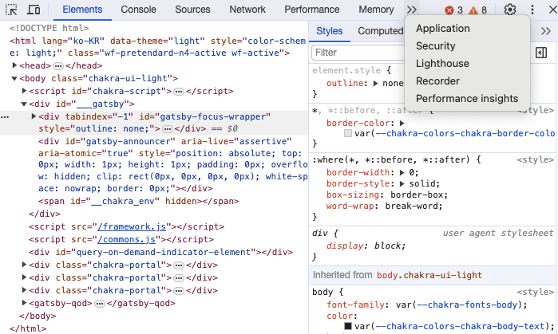
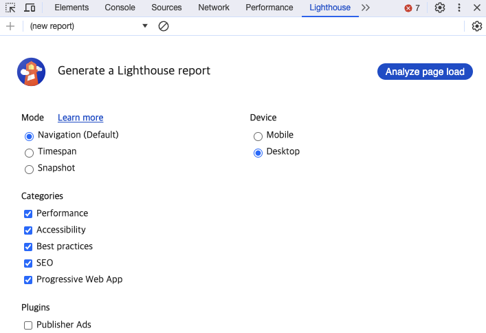
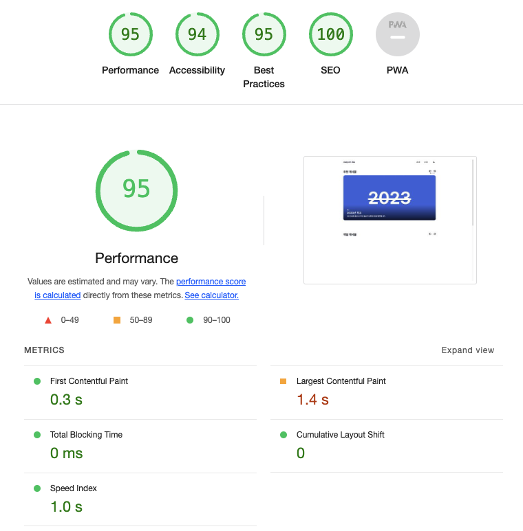
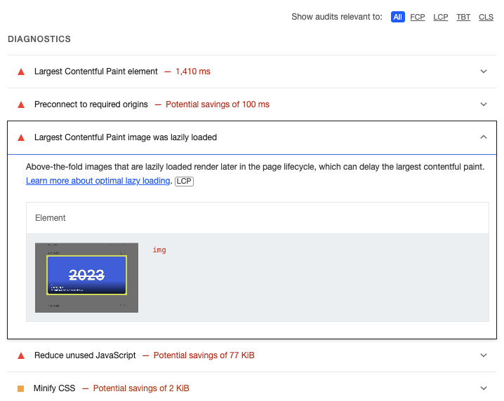
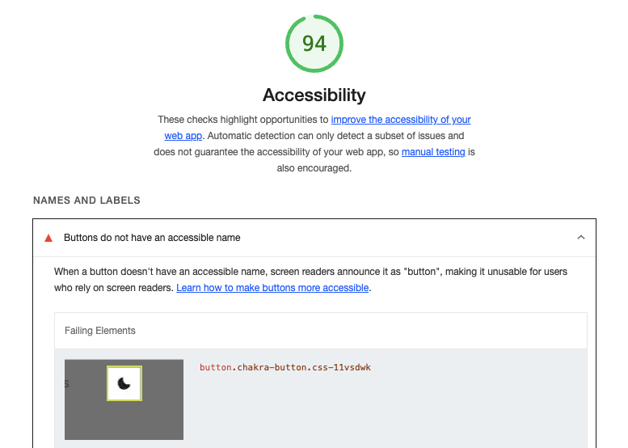

# 지난 이야기
&nbsp;SEO에 유리해야 하고 렌더링 속도가 빨라야 하는 등의 여러 가지 기준을 통해 Gatsby를 사용하여 블로그를 만들게 되고 한 가지 생각을 하게 됩니다.

# 만든 블로그를 더욱 발전시킬 수 없을까?
&nbsp;좋은 블로그라고 하면 어떤 블로그가 좋은 블로그일까요? UI/UX가 훌륭한, 양질의 게시물이 많이 있는 개개인의 기준으로 좋은 블로그를 판단하는 여러 가지 요소가 있을 겁니다.
그 중 **좋은 블로그임을 측정할 수 있는 지표**가 있다면 또 어떨까요? 오늘은 그 지표에 대해 소개하고 지표를 통해 블로그의 개선 과정을 소개하려 합니다.

# Chrome Lighthouse
&nbsp;Chrome에는 Lighthouse라는 이름의 개발자 도구가 있습니다. 이 도구는 웹 페이지 품질 개선을 위한 오픈소스 자동화 도구이며 공개된 모든 웹페이지에서 실행할 수 있으며
**웹 페이지의 성능, 접근성, PWA, SEO에 대한 검사를 진행하고 결과를 알려줍니다**. 사용 방법은 다음과 같습니다.

# 시작

&nbsp;사용법은 간단합니다. 준비물로 Google Chrome 브라우저만 있으면 됩니다. 개발자분들이라면 한 번쯤은 사용해 보셨을 개발자 도구 창을 열어 >> 버튼을 누르면
Lighthouse를 확인할 수 있습니다.

&nbsp;Lighthouse 버튼을 누르면 다음과 같은 화면이 나오게 되는데요. 여기서 Mode, Device, Categories 세 가지 분류로 여러 선택지가 있는 걸 확인할 수 있는데,
해당 분류들은 다음과 같습니다.

## Mode

- Navigation: **페이지를 처음 로드할 때의 성능을 측정**. 페이지가 로드될 때, 네트워크 요청, 렌더링 속도, 사용자가 사용할 수 있기 전까지 지연되는 시간과 같은 지표를 제공합니다.
- TimeSpan: **페이지를 오래 이용한 후의 성능을 측정**. 페이지를 여러 번 로드하고 상호 작용하며 일정 기간의 성능 평가를 진행하여 장기적인 사용에 따른 성능 변화를 확인할 때 사용합니다.
- Snapshot: **특정 시점에서의 성능 데이터가 필요할 때** 사용. 페이지 로딩 혹은 특정 이벤트 후 성능 Snapshot을 찍어 해당 시점의 자세한 데이터를 얻을 수 있으며 특정 조건이나 이벤트에서의 성능 분석이 필요할 때 사용합니다.

## Categories

- Performance: **웹 페이지의 성능 관련 지표**. 페이지 로딩 시간, 리소스 최적화, 렌더링 속도와 같은 성능 관련 지표를 제공합니다.
- Accessibility: **웹 접근성 관련 지표**. 시각, 청각과 같은 사용에 제약이 있는 사용자가 해당 웹 페이지를 잘 사용할 수 있는지를 확인하며, HTML 태그, 대체 텍스트와 같은 웹 접근성 항목을 확인합니다.
- Best Practices: **웹 개발 관행을 제대로 따랐는지에 대한 지표**. 웹 애플리케이션의 안정성과 효율성을 위해, 보안, 성능 최적화 등에 대한 웹 개발 가이드라인을 제대로 준수하고 있는지 확인합니다. 
- SEO: **검색 엔진 최적화 관련 지표**. 웹 페이지가 검색 엔진에 잘 인덱싱되고 검색 결과에 어떻게 나타나는지를 확인하기 위해, 메타 태그, 페이지  등 SEO를 향상시킬 수 있는 부분을 제대로 했는지 확인합니다.
- Progressive Wep App: **웹 앱 기능 관련 지표**. 모바일과 데스크톱 플랫폼에서 해당 웹 애플리케이션이 얼마나 잘 작동하는지 평가합니다.

## Device

&nbsp;Mobile과 Device 두 가지가 있는데, 이는 **어떤 기기 환경에서 해당 웹 애플리케이션을 평가할지 선택하는 항목**이며 모바일은 모바일 브라우저에서의 성능 및 경험, 데스크톱은, 데스크톱 브라우저에서의 성능 및 경험을 평가합니다.

# 측정

&nbsp;이제 Analyze page load 버튼을 눌러 측정을 시작하면 결과가 나오게 됩니다.

제 블로그의 메인 페이지를 대상으로 측정했으며 Performance 95점, Accessibility 94점, Best Practices 95점, SEO는 100점이지만 사용자 환경에 따라 점수는 측정할 때마다 소폭 달라질 수 있습니다.
**Performance는 다른 지표와 달리 측정 지표에도 5가지 지표**가 존재하고 지표로는 First Contentful Paint, Largest Contentful Paint, Total Blocking Time, Cumulative Layout Shift, Speed Index가 있으며 각 지표는 다음과 같습니다.

- First Contentful Paint: **사용자가 페이지를 처음으로 볼 때 걸리는 시간**
- Largest Contentful Paint: **페이지에서 가장 컨텐츠가 화면에 표시되는데 걸리는 시간**
- Total Blocking Time: **브라우저가 사용자 입력에 응답하지 않는 시간**
- Speed Index: **웹 페이지의 전체적인 시각적 로딩 속도**
- Cumulative Layout Shift: **페이지 로딩 중 버튼이나 이미지가 갑자기 생겨서 레이아웃의 변경을 측정하는 지표**

# 개선

&nbsp;그러면 결과를 바탕으로 100점을 만들 수는 없을까요? 친절하게도 Lighthouse는 100점을 만들기 위한 방법도 알려줍니다.

측정에서 나온 것처럼 Largest Contentful Paint에서 소요되는 시간이 많은데 페이지의 어떤 요소가 시간을 많이 걸리게 하는지 알려줍니다.
이는 Performance뿐만 아니라 Accessibility 지표에서도 확인할 수 있는데

접근성을 높이려면 다음과 같은 버튼에 accessible name을 설정하라고 알려주며 Best Practices, SEO에서도 이와 비슷한 진단을 확인할 수 있습니다.

# 마치며

&nbsp;지금까지 사이트 개선을 위한 방법 중 하나인 Chrome의 Lighthouse를 알아보았습니다. Lighthouse가 **사이트의 좋고 나쁨을 판단하는 절대적인 지표는 아니며**
자신이 만든 사이트를 개선하고 싶을 때, 참고하기 좋은 참고서 정도로 사용하면 좋은 것 같습니다. 지금까지 긴 글 읽어주셔서 감사합니다.