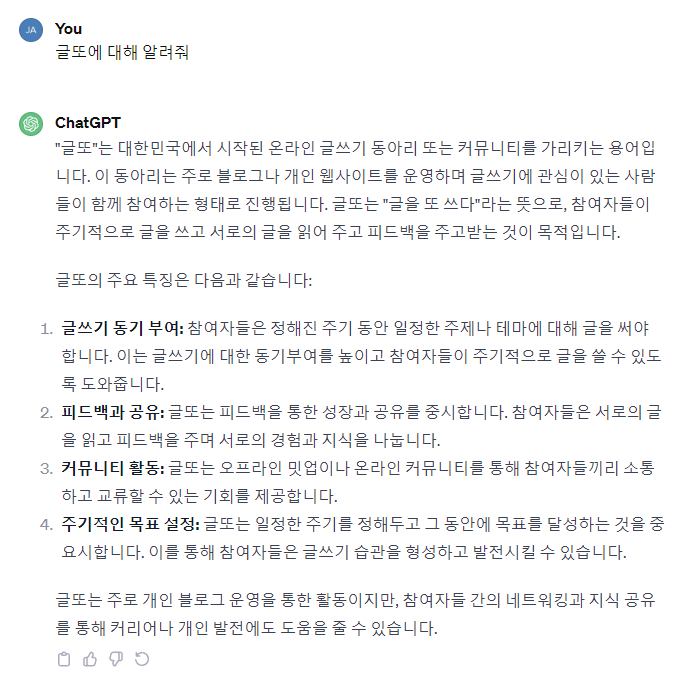

---
slug: geultto-9-1
title: '글또 9기를 시작하며'
description: '개발자 글쓰기 모임인 글또에 대한 소개와 9기 활동에 대해 공유합니다'
thumbnail: ./cover.png
category: 글또
createdAt: '2023.12.10'
updatedAt: ''
recommended: true
--- 

# 글또란?

&nbsp;ChatGPT의 소개와 같이 [글또](https://www.notion.so/zzsza/ac5b18a482fb4df497d4e8257ad4d516)란 글 쓰는 또라이가 세상을 바꾼다는 슬로건을 갖고 활동하는 **글 쓰는 개발자들의 모임** 입니다. 활동기간 동안 예치금으로 10만원씩 걷어 글을 안 쓸 경우 예치금이 차감되기에 글쓰기에 강제성이 어느 정도 부여되며 글을 쓰고는 싶은데 의지가 부족할 때 참여하면 정말 좋은 모임이고, 글쓰기 이외에도 ChatGPT가 알려주는 것처럼 온오프라인 밋업이 활발하게 진행하며 같은 직군부터 IT 분야에 소속된 다른 직군의 사람들과도 다양하게 교류할 수 있는 모임입니다.

# 7기로 활동할 때

&nbsp;제가 글또를 알게 된 계기는 종종 방문하는 개발자 오픈채팅방에서 한 분이 "여기 글또 지원하신 분 계신가요?"라고 작성한 채팅을 우연히 보고 "좋은 취지의 모임이다. 글 쓰는 건 나에게 도움이 되는 행동이니깐 지원해야겠다."라는 생각으로 7기에 처음 활동하게 됐었는데요. 당시엔 글만 쓰는 모임인 줄 알았지만, 커피챗을 7기에 처음 도입하게 되었고 같은 직군이지만 처음 접하는 분들이었기에 많이 떨렸지만 그 떨리는 순간은 얼마 가지 않아 제 개발 관련 고민도 진지하게 들어주시고 자신의 생각을 말해주시며 고민을 속시원하게 해결한 정말 값진 시간이었습니다!

# 9기를 맞이하며

> 이번 글또에선 기존과 다르게 어떤 모습으로 활동하실 건가요?(개인적 관점)

&nbsp;9기 지원서를 작성할 때, 위와 같은 문항이 존재하는데, 이 문항에 대한 답변으로 9기에 대한 저의 마음가짐을 나타낼 수 있을 것 같아요. 저번 7기 활동에서는 첫 활동이라 조금 소극적으로 움직여서 더 성장하고 배울 기회가 있었음에도 불구하고 놓친 기회들이 있다고 생각하기에 이번 9기 활동에서는 성장의 기회를 하나도 놓치지 않겠다는 당찬 포부로 좀 더 적극적인 모습을 보여드리고 싶습니다!
