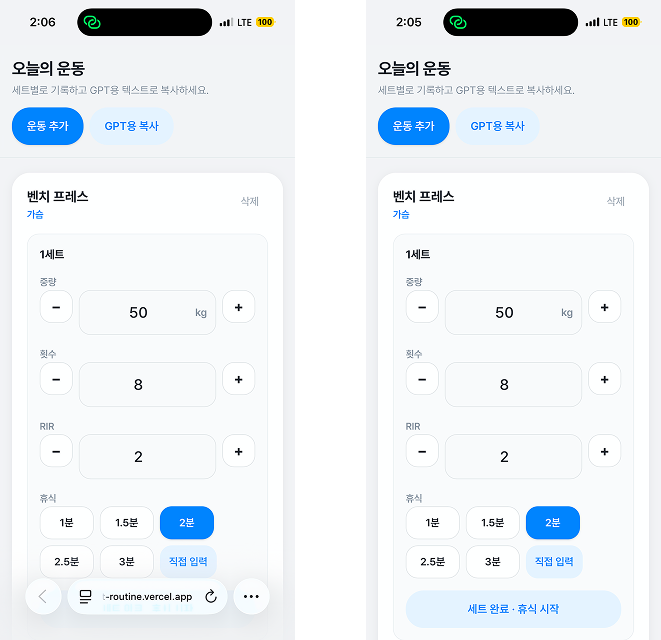

# tl;dr

&nbsp;PWA는 **HTTPS·매니페스트·서비스 워커**로 묶인 **여전히 브라우저 위의 웹**이고, standalone같은 display는 **앱처럼 보이게 하는 UI 스위치**일 뿐 **푸시·햅틱·웨어러블** 같은 네이티브급 통합을 대신 보장하지 않는다.

# 왜 이 글을 쓰게 되었나

&nbsp;PWA라는 말을 **처음으로 개념으로 접한 계기**는 [구름톤 유니브 벚꽃톤](/posts/retrospect-GoormthonUNIV-2-Spring)에 참여했을 때였다. 팀에서 아이디어를 웹으로 구현하다 보니, “**웹으로 만들고 PWA로 보여주면 된다**”는 식으로 방향이 오갔고, 그때는 솔직히 **무슨 뜻인지도 잘 모른 채** 이름만 귀에 남았다.

&nbsp;평소에 **일상에서 불편하다고 생각되는 부분**이 있으면, 거기서 출발해 작은 서비스를 만들어 보면 좋겠다고 생각하는 편이다. 그중 하나가 운동이었다. GPT와 대화하며 운동 루틴을 잡고 피드백을 받는 흐름이 익숙해지면서, **매일 헬스장에서 찍은 세트·중량·휴식**을 메모장에 일일이 적어 붙여 넣는 과정이 점점 번거로워졌다. “기록만 빠르게 하고, 나머지는 대화로 이어가면 되지 않을까?” 하는 생각이 들었고, 그때 문득 **예전에 들었던 PWA**가 떠올랐고 만들어보면서 설정한 display 옵션, 장단점과 한계를 다뤄보려 한다.

# PWA는 “새로운 프레임워크”가 아니다

&nbsp;PWA라는 말은 단지 Progressive Web App의 줄임말이 아니다. 보통 다음을 아우른다.

- **HTTPS(또는 안전한 출처)**: 서비스 워커·일부 민감 API의 전제 조건이다. **http://** 같은 비보안 출처에서는 서비스 워커 자체가 등록되지 않는다.
- **웹 앱 매니페스트(Web App Manifest)**: 이름, 아이콘, 시작 URL, 표시 모드(**standalone** 등), 테마 색 같은 **설치될 때의 메타데이터**를 브라우저에 알려준다.
- **서비스 워커(Service Worker)**: 페이지와 분리된 스레드에서 네트워크 요청을 가로채 **캐시·백그라운드 동기화·푸시(환경에 따라)** 같은 일을 할 수 있다.

&nbsp;여기에 더해 **반응형 UI**, **접근성**, **성능**(로딩·상호작용)까지 포함해 “앱다운 웹”을 말하기도 한다. 중요한 점은, **여전히 브라우저 엔진 위에서 돌아가는 웹**이라는 사실은 변하지 않는다는 것이다. 다만 그 웹이 **사용자 기기에 더 깊게 자리 잡을 수 있는 레일**을 제공한다. “설치했다”는 표현이 마치 OS에 바이너리가 깔린 것처럼 들리기 쉬운데, 실제로는 **브라우저가 제공하는 설치된 웹 앱(Installed Web App) UI**에 가깝다.

# 매니페스트의 display: 무엇이 바뀌고, 무엇이 바뀌지 않는가

&nbsp;매니페스트의 display 필드는 **설치 후(또는 설치에 준하는 전체 화면 진입 후) 브라우저 크롬(주소창·탭 바 등)을 얼마나 보여 줄지**를 정한다. [W3C Web App Manifest](https://www.w3.org/TR/appmanifest/)에 정의된 값은 대략 다음과 같다.

* **browser**: 일반 탭과 동일하게 브라우저 UI를 유지한다. “설치”해도 탭 경험에 가깝게 남을 수 있다.
* **standalone**: **브라우저의 최소 UI**로 앱을 연다. 주소창이 사라지거나 거의 보이지 않아, 사용자 입장에서는 네이티브 앱과 구분이 어렵다.
* **minimal-ui**: 아주 제한적인 브라우저 컨트롤(예: 뒤로 가기 등)을 남길 수 있다. 플랫폼마다 해석이 조금씩 다를 수 있다.
* **fullscreen**: 가능한 한 **전체 화면**에 가깝게; standalone보다 더 몰입형(게임·키오스크)에 쓰이는 경우가 많다.

&nbsp;

&nbsp;내 운동 기록 화면에는 standalone을 두었다. 이유는 단순하다. 헬스장에서는 **주소창을 열고 입력해서 방문하고 닫는 행위 자체가 주의를 빼앗고 사용자 경험을 떨어뜨린다**. start_url과 아이콘만 맞춰 두면, 사용자는 “앱 아이콘을 눌렀다”는 인지 모델로 진입하고, 화면은 **한 덩어리의 도구**처럼 느껴진다.

### standalone이 “가능하게” 하는 것

- **시각적·내비게이션 모델**: 탭/주소창 없이 시작하므로, SPA의 라우팅·하단 탭·풀스크린 레이아웃이 **앱 프레임 안에서만** 이야기되기 쉽다.
- **홈 화면·독·시작 메뉴 진입**: 브라우저가 제공하는 “설치” 흐름과 맞물려, **북마크보다 한 단계 짧은 재진입 경로**를 만든다.
- **테마 색(theme_color)·상태 표시줄 영역**: OS와의 경계(노치, 세이프 에어리어)를 웹이 **앱처럼** 맞추기 쉬워진다.

### standalone이 바꾸지 않는 것(중요)

&nbsp;display는 **UI 껍데기** 설정이다. 다음은 그대로다.

- **실행 주체**: 여전히 브라우저 프로세스 안의 렌더러다. 네이티브처럼 “앱 프로세스”가 따로 생기는 구조가 아니다(플랫폼별로 창 관리는 다르지만, 웹 엔진이라는 점은 같다).
- **권한의 깊이**: 카메라·마이크·알림 등은 **각 API와 OS 정책**의 문제이지, standalone이 자동으로 “앱 등급 권한”을 열어 주지는 않는다.

&nbsp;즉 **“앱처럼 보인다”와 “앱과 같은 능력”은 별개**다. 사용자에게는 동일한 아이콘으로 보일 수 있지만, 개발자는 **무엇이 브라우저 정책으로 막히는지**를 따로 공부해야 기대치가 맞는다.

# 네이티브 앱과 비교했을 때: 무엇이 아직 “앱 같지” 않은가

&nbsp;아이콘과 전체 화면만으로는 사용자가 **스토어 앱과 동일한 깊이**를 기대하기 쉽다. 개발자 입장에서 체감되는 “덜 앱 같은” 지점을 몇 가지 짚어 본다.

## 푸시 알림과 백그라운드

&nbsp;Android Chrome 환경에서는 Web Push와 서비스 워커의 조합으로 **꽤 앱에 가까운 알림**을 구현할 수 있는 경우가 많다. 반면 **iOS는 16.4 이후 홈 화면에 추가된 웹 앱에 한해** Web Push 지원이 생겼고, 그마저도 **Safari·OS 버전·설치 형태**에 따라 달라진다. “웹 하나로 모든 사용자에게 동일한 푸시”는 아직도 어렵다.

&nbsp;운동 루틴 알림처럼 **시간에 민감한 로컬 알림**을 네이티브는 OS 스케줄러와 밀접하게 붙여 다루기 쉬운데, 웹은 **브라우저가 허용하는 백그라운드 실행 시간** 안에서만 움직이는 경우가 많다. “알림이 100% 온다”가 제품의 핵심이면, PWA만으로는 리스크가 크다.

## 햅틱·진동·몰입형 피드백

&nbsp;웹에는 **Vibration API**가 있지만, 지원·정책 제약이 있고 **iOS Safari에서는 사실상 기대하기 어렵다**는 식의 제약이 오래 이어져 왔다. 네이티브의 **Taptic Engine 수준의 미세한 햅틱**, **패턴 제어**, **시스템 전역과의 동기화**를 웹이 그대로 대체한다고 보기는 어렵다.

&nbsp;운동 앱에서 “휴식 시간 종료 시 짧은 진동이나 푸시 알람” 같은 피드백은 사소해 보여도 체감 품질에 기여하는데, 웹에서는 **시각·소리** 쪽으로 우회 설계하는 경우가 많다. “PWA로 앱처럼 보이게 했다”는 말과 **손끝의 피드백**은 아직 거리가 있다.

## 블루투스·웨어러블·헬스 데이터

&nbsp;Web Bluetooth 등으로 일부 기기는 연결할 수 있지만, **지원 기기·보안 정책·사용자 제스처 요구** 때문에 네이티브 SDK 수준의 “모든 웨어러블과 매끄럽게 연동”은 어렵다. Apple Watch나 건강 앱과의 **HealthKit 급 통합**을 기대하면 PWA는 출발점부터 어긋난다.

## 성능 상한

&nbsp;웹 엔진은 빨라졌지만, **동일한 하드웨어에서 게임·영상 편집·무거운 오디오 파이프라인**까지 네이티브와 동등을 노리는 영역은 여전히 네이티브가 유리한 경우가 많다. 운동 기록처럼 **폼·리스트·타이머** 중심이면 웹이 충분히 납득 가능한 성능을 내기 쉽다.

# 장점: 무엇이 특히 강한가

- **배포의 단순함**: 앱 스토어 심사 주기 없이 서버에 올리면 된다(단, 스토어 없이도 설치 유도는 별도 과제다).
- **코드베이스 단일화**: iOS·Android·데스크톱 브라우저를 한 웹으로 커버하기 쉽다. 대신 **플랫폼별 capability 차이**는 문서와 테스트로 상쇄해야 한다.
- **링크와 검색**: URL로 공유·북마크가 자연스럽다. 콘텐츠형 서비스뿐 아니라 **도구형 웹**에도 잘 맞는다.

# 단점과 한계: 어디서 기대를 낮춰야 하는가

- **플랫폼 편차**: 특히 iOS Safari 계열은 **푸시·백그라운드·스토리지 한도** 등에서 Android/데스크톱과 다르게 느껴질 수 있다. “웹 하나로 모두 동일”은 기대하기 어렵다.
- **발견성**: 스토어 검색·랭킹에 올라가는 네이티브 앱과 달리, **유입 설계**(SEO, 공유 링크, QR, 커뮤니티)를 스스로 해야 한다.
- **권한과 신뢰**: 알림·블루투스·파일 등은 **사용자 허용·보안 정책**에 크게 묶인다. 네이티브만큼 깊은 시스템 통합을 기대하면 실망할 수 있다.

# 마치며

&nbsp;PWA는 **웹을 앱처럼 쓰게 해 주는 마법**이라기보다, **매니페스트·서비스 워커·HTTPS**가 만들어내는 **구체적인 능력치의 합**에 가깝다. 그중 display: 'standalone'은 **브라우저 크롬을 걷어내 사용자의 인지 모델을 “앱” 쪽으로 옮기는 스위치**에 가깝고, 동시에 **OS 레벨 통합을 자동으로 열어 주는 스위치는 아니다**.

&nbsp;그 능력의 합은 **매일 잠깐 쓰는 기록 도구**, **오프라인이 잦은 현장 도구**, **배포 속도가 생명인 실험** 같은 곳에서 특히 빛난다. 운동 기록 앱을 만들면서 다시 느낀 것은, 기술 이름보다 **사용 맥락**(헬스장, 휴식 타이머, 복사 후 GPT로 이어 붙이기)을 먼저 잡았을 때 PWA가 **딱 필요한 만큼만** 어울린다는 사실이었다. 비슷한 도구를 설계하는 분들께, 이 정리가 작은 참고가 되면 좋겠다.

**지금까지 긴 글 읽어주셔서 감사합니다.**
