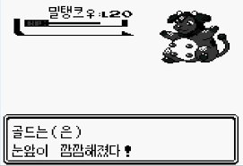

# 2023년

## 소집해제

&nbsp;2022년 1월, 사회복무요원을 시작할 당시, 2023년하고도 10월이 정말 오긴 할까? 생각이 들 정도로 오지 않을 것 같았던 사회복무요원 생활도 끝나게 되었다.
사회복무요원으로 복무하며 재학생 시절만큼 공부할 수는 없었지만 감사하게도 자투리 시간과 공부할 수 있는 시간이 있었기에 자투리 시간에는 자세히 후술하겠지만
평소 생각만 하고 실천으로 옮기지 못했던 독서를 시작하고 공부할 수 있는 시간에는 개발 관련 공부와 함께 지금, 이 글을 보고 있는 나만의 블로그도 만들게 됐다.
특수 학생을 지도하는 업무라 어렵고 힘든 순간이 많았지만, 일상생활을 통해서는 접하기 어려운 경험이었기에 장애라는 분야에 대해 배우고 느낀 점도 많았으며
특히 이 계기를 통해 인내심과 끈기가 많이 향상된 것 같다.

## 운동

&nbsp;2022년 새해에도 열심히 운동하자는 다짐으로 등록한 헬스장은 초반에는 열심히 다녔지만, 그 열정이 금방 식어버려 주에 한두 번, 운동한다고 말하기 쑥스러울 빈도로 다녔었다.
하지만 23년 1월 훈련소를 다녀오고 친구들과 함께 찍은 사진 속 내 자신을 보며 운동의 필요성을 느껴 2월부터 본격적으로 [웨이트 트레이닝](https://terms.naver.com/entry.naver?docId=1208680&cid=40942&categoryId=31946)을 시작했다.
운동은 일정이 바쁜 날을 제외하면 거의 매일 간다 싶을 정도로 사회복무요원으로 생활할 때는 퇴근 후에 헬스장에 방문했고 사회복무요원이 끝난 지금은 아르바이트와 병행하며 다니고 있다.
운동의 장점은 하면서도, 하고 나서도 있다 느껴질 정도로 **운동을 할 때는 오로지 내 몸에 집중하기 때문에 평상시 머리를 괴롭히던 고민이나 스트레스에서 해방되는 기쁨을 누릴 수 있고
운동을 하고 나서는 좋아지는 몸, 높아져 가는 봉의 무게를 보며 더 나은 내가 된다는 점이 나의 자존감을 향상해 주었다**.

## 독서

&nbsp;독서를 시작한 초기에는 평소 자기 계발에 관심이 많았어서 데일 카네기의 인간관계론, 자기관리론으로 시작해 신경 끄기의 기술, 원인과 결과의 법칙, 초집중이란 책을 읽었다.
모두 좋은 책이었고 이쯤 되니 너무 자기 계발 관련 도서만 읽나 싶어서 한 분야의 책만 읽지 말고 다양한 분야의 책을 읽어보기로 결심했고 그 일환으로 책을 안 읽는 사람들도 한 번쯤
들어봤을 총, 균, 쇠를 읽었다. 독서하며 느꼈던 **가장 좋은 점은 모호했던 주관이 뚜렷해지고 집중력이 향상되며 세상을 바라보는 시각이 넓어지는 것**이었다. 사회복무요원으로 활동하며
많이 읽었고 끝난 이후에는 거의 읽지 못했는데, 내년에는 올해보다 한 권이라도 더 읽자는 목표로 독서할 것이다.

# 마치며

&nbsp;초집중이라는 책에서 **그 어떤 재물보다 인색해야할 시간이라는 자산을 사람들이 낭비한다**고 표현하는 인상깊은 구절이 있다. 스마트폰으로 SNS나 유튜브를 볼 때마다
생각하지만 아직도 많이 낭비하고 있다. 내년에는 **시간의 가치를 좀 더 소중히 여기며 원하는 목표를 이루기 위해 노력하는 삶을 살자**.